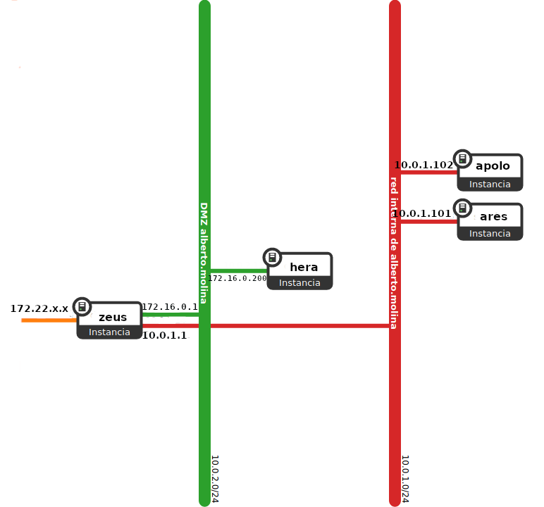

En esta tarea se va a crear el escenario de trabajo que se va a usar durante todo el curso, que va a constar inicialmente de 4 instancias con nombres relacionados con los dioses griegos.

Pasos a realizar:

1. Creación de la red interna (very-isolated):
    * Nombre: "red interna de <nombre de usuario>"
    * Direccionamiento: 10.0.1.0/24
2. Creación de la red DMZ (very-isolated):
    * Nombre: "red DMZ de <nombre de usuario>"
    * Direccionamiento: 172.16.0.0/16
3. Creación de las instancias
    * Máquina 1 (zeus)
        * Debian 11 sobre volumen de 10GB, 512 Mb y 1vCPU.
        * Conectada a una red externa (puente) y con una IP "pública".
        * Conectada a la red interna y a la red DMZ, de la que será la puerta de enlace (10.0.1.1, y 172.16.0.1)
    * Máquina 2 (ares)
        * Ubuntu 20.04 sobre volumen de 10GB, 512 Mb y 1vCPU.
        * Conectada a la red interna
        * Dirección: 10.0.1.101
        * Accesible indirectamente a través de zeus
    * Máquina 3 (apolo)
        * Debian 11 sobre volumen de 10GB, 512 Mb y 1vCPU.
        * Conectada a la red interna
        * Dirección: 10.0.1.102
        * Accesible indirectamente a través de zeus
    * Máquina 4 (hera)
        * Rocky 8 sobre volumen de 10GB, 512 Mb y 1vCPU.
        * Conectada a la red DMZ
        * Dirección: 172.16.0.200
        * Accesible indirectamente a través de zeus
4. Configuración de SNAT en zeus.
5. Definición de contraseña en todas las instancias (para poder modificarla desde consola en caso necesario).
6. Configuración de ssh en tu cliente para acceder a todas las instancias.
7. Creación del usuario `profesor` en todas las instancias. Usuario que puede utilizar `sudo` sin contraseña. 
8. Copia de las claves públicas de todos los profesores en las instancias para que puedan acceder con el usuario `profesor`.
9. Realiza una actualización completa de todos los servidores.
10. El dominio utilizado sera del tipo `tunombre.gonzalonazareno.org`.
11. Nombrar de forma adecuada: FQDN todas las máquinas. 
12. Hasta que no esté configurado el servidor DNS, incluye resolución estática en las cuatro instancias tanto usando nombre completo como hostname.
13. Instala en apolo un servidor dns bind9, de tal manera que sea el servidor DNS de todas las máquinas.

La creación y configuración (conexión a las redes, creación de volumen, ...) de la máquina 1 la debes hacer con virsh. Lo demás lo puedes hacer con virt-manager.


## Entrega...

* Las instrucciones para crear y configurar la máquina 1.
* La IP pública de zeus.


{{ notice-text | markdownify }}

