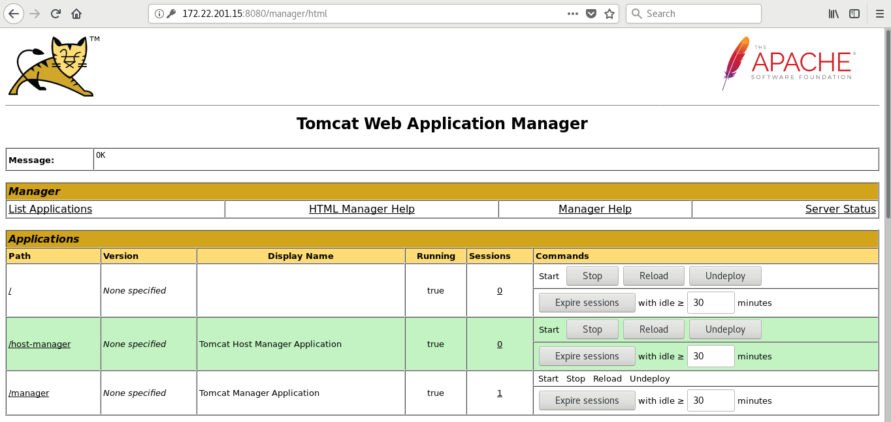

En el siguiente documento se explicará como implantar un contenedor de servlets Tomcat versión 10 en un sistema Linux Debian.

## Instalación

Para instalar tomcat10 desde repositorios:
	
	apt install tomcat10

Por dependencia va a instalar el paquete `openjdk-17-jre-headless`, que corresponde a una implementación de la JVM mínima para poder ejecutar nuestros programas java.

Desde este momento tendremos Tomcat ejecutándose y sirviendo en el puerto 8080.

Para gestionar el servicio tomcat:

	systemctl stop|start|restart|status tomcat10

## Opciones del servicio tomcat

Para modificar las opciones del servicio tomcat (que se guardan en la variable `JAVA_OPTS`) tenemos que indicarlas en el fichero `/etc/default/tomcat10`. Por defectos las opciones que tenemos configuradas son:

	JAVA_OPTS="-Djava.awt.headless=true"

Para implantar algunas aplicaciones que necesitan mucha memoria RAM tenemos que añadir una opción indicando la cantidad de memoria que puede usar el servicio, por ejemplo para indicar 1Gb de memoria sería:

	JAVA_OPTS="-Djava.awt.headless=true -Xmx1024m"

## Despliegue de aplicaciones mediante la terminal

Implantar una aplicación desde la terminal, tampoco es tan difícil, ya que por defecto cualquier fichero `.war` que se copie o mueva dentro de l directorio `/var/lib/tomcat10/webapps/` se desplegaría automáticamente y dependiendo de nuestra configuración se lanzaría o no.

En mucha documentación sobre tomcat se refiere a la variable de entorno `$CATALINA_HOME`, en un debian donde hemos instalado tomcat con apt, el valor de esta variable será `/var/lib/tomcat10`.
{: .notice--warning}

## Administración

Esta sección la iniciaremos utilizando una herramienta que nos proporciona la fundación Apache y que nos facilita el despliegue de aplicaciones y manejo del servidor, Tomcat-Manager. Para instalarlo:

	# apt install tomcat10-admin

Una vez instalado debemos crear un usuario con el rol manager para acceder a él. Añadimos una línea similar a la siguiente al fichero `/etc/tomcat10/tomcat-users.xml`:

	<role rolename="manager-gui"/>
	<user username="tomcat" password="s3cret" roles="manager-gui"/>

Para acceder a la zona de administración:

 
## Despliegue de aplicaciones mediante la interfaz web

Utilizaremos la herramienta anterior para explicar cómo desplegar una aplicación, por ejemplo .war. Simplemente bajamos con el scroll hasta encontrar una sección llamada "WAR file to deploy". Seleccionamos el fichero .war y le damos al botón "Deploy".

Puedes bajarte el fichero war desde el siguiente [enlace](war/RequestDispatcher.war).

Automáticamente se creará un nuevo elemento en la sección aplicaciones utilizando el mismo
nombre que el fichero .war subido.

Desde aquí podremos controlar la aplicación (Arrancarla, pararla, eliminarla,...)

## Administración desde la terminal

Es hora de hablar de los ficheros de configuración. 

### server.xml

El más importante es `/etc/tomcat10/server.xml`, cuyo contenido define cómo está configurado nuestro servidor de aplicaciones java. Las secciones más importante de este fichero son:

* Componente **Server**: es el elemento principal del archivo `server.xml` y representa el servidor.
* Componente **Service**: Un servicio es un grupo de conectores.
	* Subelemento **Connector**: El elemento `Connector` representa las conexiones (Puertos TCP) que serán abiertas por Tomcat al arranque, se definen diversos atributos los cuales dan más detalles acerca de la conexión. Por defecto se define el puerto 8080.
	Nos encontramos comentados el conector para configurar HTTPS.
	* Subelemento **Engine**: Todas las peticiones que lleguen al servidor, se procesaran según la configuración de este elemento. Es similar a los VirtualHost de los servidores web.

### context.xml

Fichero de configuración específico de cada aplicación. Si alguna aplicación se despliega sin fichero `context.xml`, se aplicará la configuración del situado en `/etc/tomcat10/context.xml`. Su utilización es similar a la del fichero `.htaccess` de Apache.

### web.xml

Su ruta real es `aplicacion/web-inf/web.xml`, se trata de un descriptor de despliegue. Al igual que con el fichero `context.xml`, Tomcat posee un `web.xml`alojado en `/etc/tomcat10/web.xml` que se ejecuta antes del propio de cada aplicación. Con él se pueden activar y desactivar características como el compilador de JSP.


**Ejercicio**

Instala **apache tomcat** en un equipo y despliega la aplicación: [EjemploPruebaCarga.war](war/EjemploPruebaCarga.war) desde la línea de comandos.


{{ notice-text | markdownify }}

