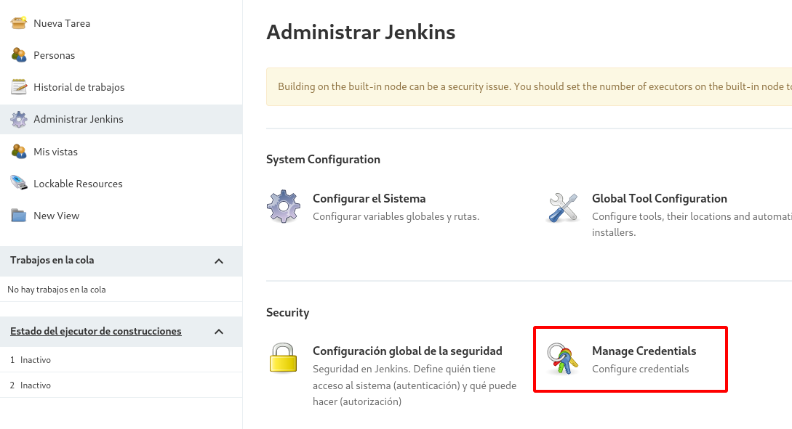
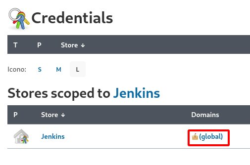
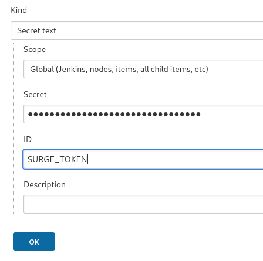

En este ejercicio queremos desplegar una página HTML5 en el servicio *surge.sh*, además queremos comprobar si el código HTML5 es válido. Estas dos operaciones: comprobar si el HTML5 es válido (test) y el despliegue en surge.sh (deploy) lo vamos a hacer con Jenkins de forma automática (IC y DC). Recuerda que el repositorio es [https://github.com/josedom24/ic-html5](https://github.com/josedom24/ic-html5).

Como vimos en el ejemplo 2, para hacer el despliegue necesitamos guardar el token que hemos obtenido de surge para que nos autentifiquemos. veamos como trabajar con credenciales en Jenkins.

## Crear credenciales

Podemos crear varios tipos de credenciales: usuario y contraseña, credenciales ssh,... Nostros vamos a crear un *Secret text* para guardar el token de surge.

Para crear la credencial:








## Creación del pipeline

En el repositorio puedes encontrar el fichero `Jenkinsfile` con el siguiente contenido:

```groovy
pipeline {
    environment {
        TOKEN = credentials('SURGE_TOKEN')
      }
    agent {
        docker { image 'josedom24/debian-npm'
        args '-u root:root'
        }
    }
    stages {
        stage('Clone') {
            steps {
                git branch:'master',url:'https://github.com/josedom24/ic-travis-html5.git'
            }
        }
        
        stage('Install surge')
        {
            steps {
                sh 'npm install -g surge'
            }
        }
        stage('Deploy')
        {
            steps{
                sh 'surge ./_build/ josedom24.surge.sh --token $TOKEN'
            }
        }
        
    }
}
```

1. En el apartado `environment` leo una variable de entorno a a partir de la credencial que habíamos creado.
2. Uso la imagen `josedom24/debian-npm`, imagen que yo he generado de una `debian` con `npm` instalado. De esta manera no necesito instalar `npm` que es un proceso lento.
3. Clono el repositorio.
4. Instalo `surge`. En realidad podría haberlo instalado en la imagen que he generado.
5. En el stage `Deploy` hago el despliegue.

## Disparador del pipeline

¿Podríamos activar el pipeline cuando hagamos un push al repositorio? La respuesta es sí, tendríamos que escoger como **Build Trigger** la opción **GitHub hook trigger for GITScm polling**.

A continuación tendríamos que crear un Webhook en tu repositorio de gitHub. Los **webhooks** ofrecen una manera de enviar las notificaciones a un servidor web externo siempre que ciertas acciones ocurran en un repositorio o una organización.

Para más información: [Triggering a Jenkins build on push using GitHub webhooks](https://faun.pub/triggering-jenkins-build-on-push-using-github-webhooks-52d4361542d4).

Tenemos un problema: al crear el webhook debemos indicar la dirección de nuestro jenkins, que tiene que ser accesible desde internet, pero nuestra instalación es local. Para hacer una prueba en nuestro servidor de jenkins local podríamos hacer uso de [ngrok](https://ngrok.com/).

