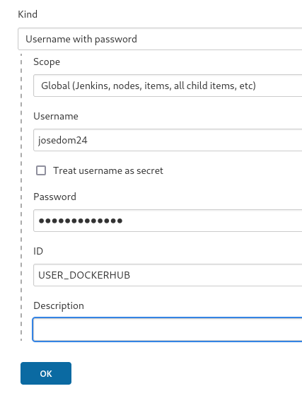
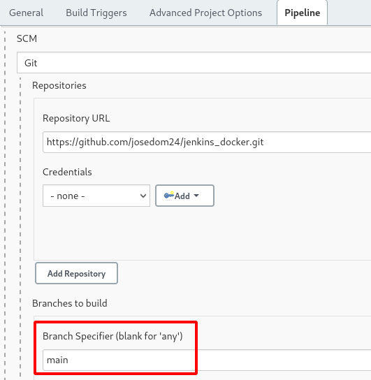

El plugin `Docker` que instalamos en un ejemplo anterior, además de posibilitar correr nuestros pipelines en contenedores docker, nos ofrece la posibilidad de trabajar con docker: crear imágenes, probarlas, publicarlas en un registro,...

En este apartado vamos a crear un pipeline, que va a realizar la siguientes tareas:

* Va a clonar un repositorio donde tenemos un `Dockerfile`.
* Va a construir la imagen.
* Va a hacer un pequeño test: va a crear un contenedor y va a comprobar que tiene apache2 instalado.
* Va a subir la imagen a DockerHub.
* Y finalmente, va a borrar la imagen generada.

El repositorio donde se encuentra el `Dockerfile` y el `Jenkinsfile` es [https://github.com/josedom24/jenkins_docker](https://github.com/josedom24/jenkins_docker).

## Credenciales para subir la imagen a DockerHub

Hemos creado unas credenciales del tipo usuario - contraseña:



## Pipeline

Una cosa al indicar que lea el pipeline de un Jenkinsfile es que por defecto lo va buscar en la rama **master**. En los nuevos repositorios hay que cambiarla por **main**:



El fichero `Jenkinsfile` tiene el siguiente contenido:

```groovy
pipeline {
    environment {
        IMAGEN = "josedom24/myapp"
        USUARIO = 'USER_DOCKERHUB'
    }
    agent any
    stages {
        stage('Clone') {
            steps {
                git branch: "main", url: 'https://github.com/josedom24/jenkins_docker.git'
            }
        }
        stage('Build') {
            steps {
                script {
                    newApp = docker.build "$IMAGEN:$BUILD_NUMBER"
                }
            }
        }

        stage('Test') {
            steps {
                script {
                    docker.image("$IMAGEN:$BUILD_NUMBER").inside('-u root') {
                           sh 'apache2ctl -v'
                        }
                    }
            }
        }
        
        stage('Deploy') {
            steps {
                script {
                    docker.withRegistry( '', USUARIO ) {
                        newApp.push()
                    }
                }
            }
        }
        stage('Clean Up') {
            steps {
                sh "docker rmi $IMAGEN:$BUILD_NUMBER"
                }
        }
    }
}
```

Algunas cosas a tener en cuenta:

1. Al clonar el repositorio hemos indicado la rama.
2. `agent any`: Este pipeline se ejecuta en el nodo principal.
3. `USUARIO = 'USER_DOCKERHUB'`, las credenciales del tipo username/pasword se leen de esta forma.
