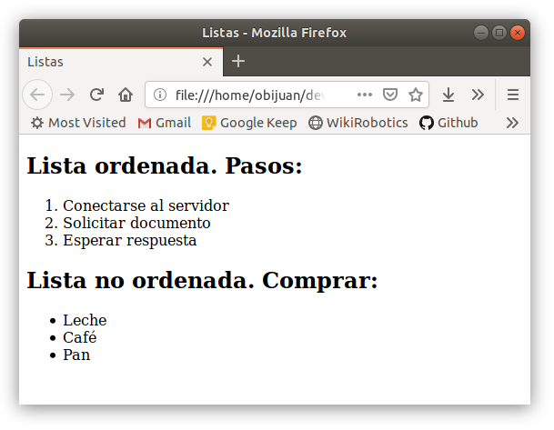

**HTML** nos permite estructurar la información. El diseño y el formato lo defineremos con las **hojas de estilo**.

## Etiquetas básicas HTML5

El stándard de HTML5 se aprobó el 28 de octubre de 2014. Podéis encontrar la [documentación oficial de todas las etiquetas] en la página W3C (El Consorcio World Wide Web (W3C) es una comunidad internacional donde las organizaciones Miembros, personal a tiempo completo y el público en general trabajan conjuntamente para desarrollar estándares Web). 

## Etiquetas de línea y etiquetas de bloque

* Una **etiqueta de línea** es aquella que ocupa el espacio mínimo necesario en horizontal, y permite que otro elemento se coloque a su lado. 
* En cambio una **etiqueta de bloque**, ocupa todo el ancho disponible y no permite que otro elemento se coloque a su lado (aunque aparentemente tenga lugar suficiente).

Etiquetas de línea (las más usadas):

`<a>, <span>, <strong>, , <input>, <code>`

Etiquetas de bloque (las más usadas):

`<h1>, <h2>, <h3>, <p>, <ul>, <li>, <div>, <header>, <nav>, <section>, <article>, <footer>, <form>, <table>`

Vamos a estudiar algunas de ellas:

### Encabezados

Los **encabezados** se representan mediante las etiquetas `h1, h2, ..., h6`. Hay por tanto 6 niveles de encabezamiento. La etiqueta `h1` representa un encabezado más general: Capítulo, Tema... Mientras que `h6` es el encabezado más profundo. Los encabezados son **etiquetas de bloques**.

Ejemplo:

```html
<!DOCTYPE html>
<html lang="es" dir="ltr">
  <head>
    <meta charset="utf-8">
    <title>Encabezado</title>
  </head>
  <body>
    <h1>Encabezado H1</h1>
    <h2>Encabezado H2</h2>
    <h3>Encabezado h3</h3>
    <h4>Encabezado h4</h4>
    <h5>Encabezado h5</h5>
    <h6>Encabezado h6</h6>
    <p>Párrafo...</p>
  </body>
</html>
```
Al visualizarlo en un navegador, obtenemos lo siguiente:


### Párrafos

Se utilizan mucho. Típicamente hay varios párrafos dentro del cuerpo. Aunque en el HTML lo separemos en diferentes líneas, todo el texto que esté dentro del mismo párrafo se coloca en la misma línea. Esta etiqueta es una **etiqueta de bloque**.

```html
<!DOCTYPE html>
<html lang="es" dir="ltr">
  <head>
    <meta charset="utf-8">
    <title>Párrafos</title>
  </head>
  <body>
    <p>Es es un párrafo. Puede ser todo lo extenso que se quiera
    Aunque en el HTML lo coloquemos en varias
    líneas, en el renderizado se coloca según el tamaño
    de la pantalla del navegador</p>

    <p>Este es otro párrafo.
      Se coloca separado del anterior</p>

    <p>Este párrafo tiene 3 líneas
     Pero el navegador las coloca juntas
     Otra líneas
     Y otra</p>
  </body>
</html>
```

Se renderizaría de la siguiente manera:


### Listas

Las **listas** nos permiten colocar texto en líneas separadas. Pueden ser listas ordenadas o no ordenadas. Para las primeras usamos las etiquetas:

`<ol></ol>`

mientras que para las segundas:

`<ul></ul>`

Los elementos colocados dentro de la lista, ordenadas o sin ordenar, se sitúan con la etiqueta:

 `<li>Elemento de la lista</li>`

Esta etiqueta debe estar siempre dentro de alguna de las anteriores

Ejemplo de uso de listas ordenadas y no ordenadas

```html
<!DOCTYPE html>
<html lang="es" dir="ltr">
  <head>
    <meta charset="utf-8">
    <title>Listas</title>
  </head>
  <body>
    <h2>Lista ordenada. Pasos:</h2>
    <ol>
      <li>Conectarse al servidor</li>
      <li>Solicitar documento</li>
      <li>Esperar respuesta</li>
    </ol>
    <h2>Lista no ordenada. Comprar:</h2>
    <li>Leche</li>
    <li>Café</li>
    <li>Pan</li>
  </body>
</html>
```

Queda renderizado de la siguiente manera:



