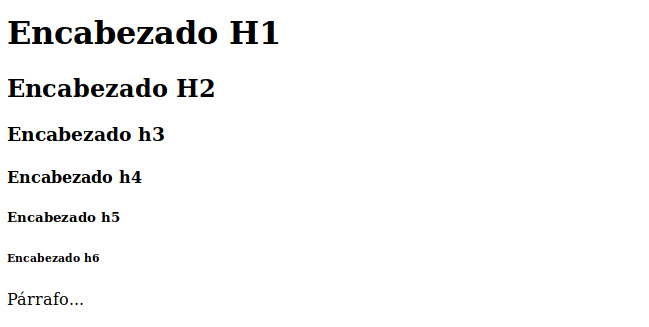
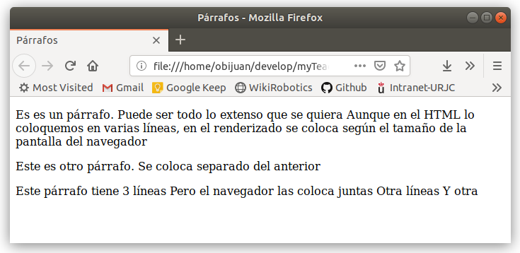
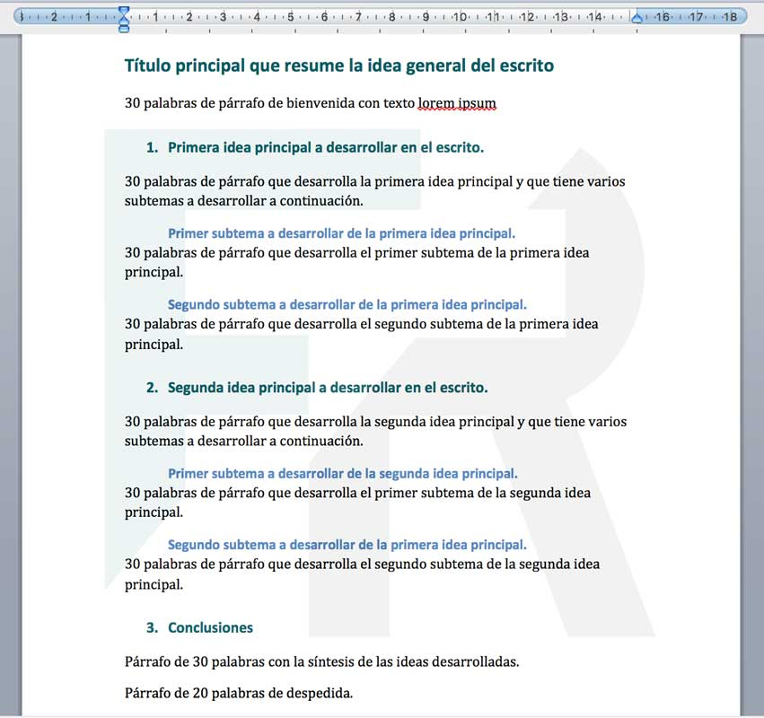
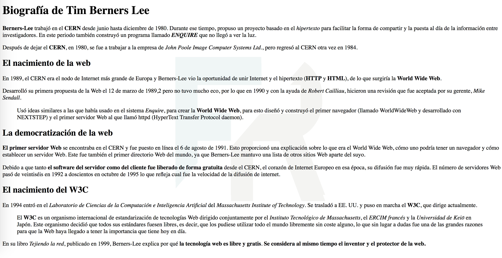
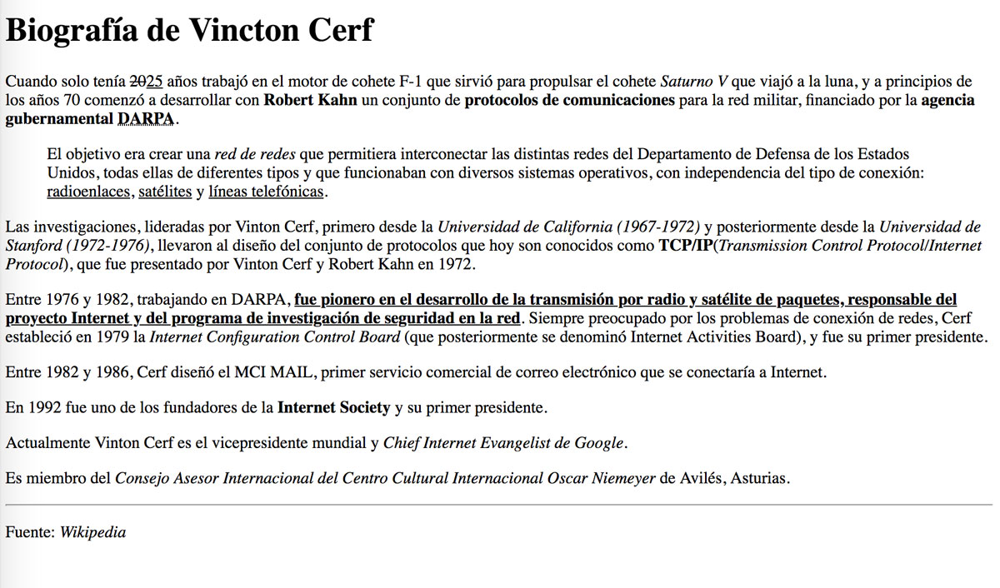

## Encabezados

Los **encabezados** se representan mediante las etiquetas `h1, h2, ..., h6`. Hay por tanto 6 niveles de encabezamiento. La etiqueta `h1` representa un encabezado más general: Capítulo, Tema... Mientras que `h6` es el encabezado más profundo. Los encabezados son **etiquetas de bloques**.

Ejemplo:

```html
<!DOCTYPE html>
<html lang="es" dir="ltr">
  <head>
    <meta charset="utf-8">
    <title>Encabezado</title>
  </head>
  <body>
    <h1>Encabezado H1</h1>
    <h2>Encabezado H2</h2>
    <h3>Encabezado h3</h3>
    <h4>Encabezado h4</h4>
    <h5>Encabezado h5</h5>
    <h6>Encabezado h6</h6>
    <p>Párrafo...</p>
  </body>
</html>
```
Al visualizarlo en un navegador, obtenemos lo siguiente:



## Párrafos

Se utilizan mucho. Típicamente hay varios párrafos dentro del cuerpo. Aunque en el HTML lo separemos en diferentes líneas, todo el texto que esté dentro del mismo párrafo se coloca en la misma línea. Esta etiqueta es una **etiqueta de bloque**.

```html
<!DOCTYPE html>
<html lang="es" dir="ltr">
  <head>
    <meta charset="utf-8">
    <title>Párrafos</title>
  </head>
  <body>
    <p>Es es un párrafo. Puede ser todo lo extenso que se quiera
    Aunque en el HTML lo coloquemos en varias
    líneas, en el renderizado se coloca según el tamaño
    de la pantalla del navegador</p>

    <p>Este es otro párrafo.
      Se coloca separado del anterior</p>

    <p>Este párrafo tiene 3 líneas
     Pero el navegador las coloca juntas
     Otra líneas
     Y otra</p>
  </body>
</html>
```

Se renderizaría de la siguiente manera:



## Otras etiquetas de texto

Veamos de forma resumida otras etiquetas relacionadas con el marcado de texto. En muchas ocasiones pueden parecer que estas etiquetas otorgan un formato a la información. Esta afirmación es falsa, las etiquetas clasifican la información semanticamente, pero lo que pasa es que el navegador web por defecto la muestra con un determinado formato.

Hay multitud, todas le dan cierto estilo al texto que contienen y destacaremos las siguientes:

* `<strong>...</strong>` el navegador la pone en negrita, pero la usamos para indicar la importancia de una información.
* `<i>...</i>` Se pone el texto en cursiva, pero se usa para resaltar una información.
* `<b>...</b>`: Parecida a `strong`, nos sirve para resaltar una información, en el navegador se pone en negrita.
* `<del>...</del>` para mostrar un texto tachado.
* `<em>...</em>` Se pone el texto en cursiva, pero se usa para resaltar una información.
* `<sup>...</sup>` para poner un texto como superíndice de otro texto.
* `<sub>...</sub>` para poner un texto como subíndice de otro texto.
* `<mark>...</mark>` para poner un texto subrayado.
* `<q>...</q>` para mostrar una pequeña cita.
* `<cite>...</cite>` para mostrar el título de una referencia bibliográfica.
* `<time>...</time>` para mostrar horas.
* `<address>...</address>` para mostrar direcciones.
* `<blockquote>...</blockquote>` para poner citas largas.

## Otras etiquetas interesantes

* `<br/>` Salto de línea.
* `<hr/>` Separación de Tema.


## Ejercicio 1

Queremos crear una página web con la siguiente [información](doc/texto.txt). Tienes que usar las etiquetas de cabeceras para estructurar dicha información siguiendo la estrucutra que puedes ver en este documentos de texto:



[Compruebe la solución](doc/solucion2.txt)

## Ejercicio 2

Descárgate el siguiente [documento html](doc/Berners-Lee-Wikipedia.html.zip), y modifícalo que tenga un formato según la imagen:



[Compruebe la solución](doc/solucion3.txt)


## Ejercicio 3

Descárgate el siguiente [documento html](doc/Enunciado-Vincton-Cerf.html.zip), y modifícalo que tenga un formato según la imagen:



[Compruebe la solución](doc/solucion4.txt)

