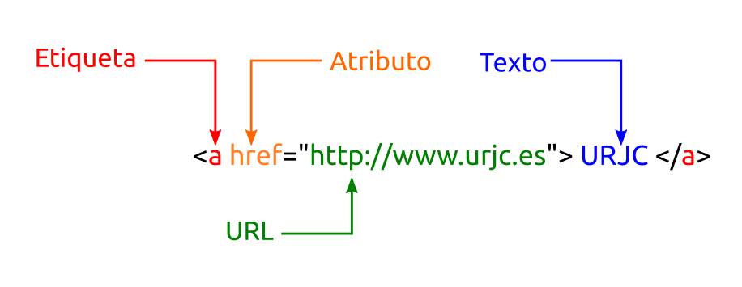
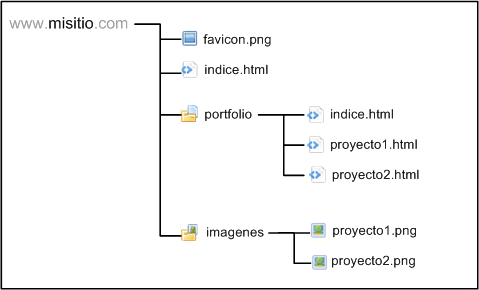
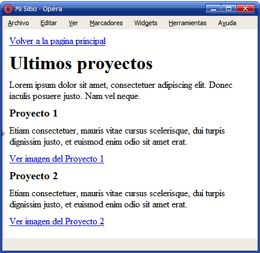

Los enlaces se establecen con la etiqueta `a` y el atributo `href`, que indica la URL del enlace:

Los enlaces, que se representan mediante el uso de la etiqueta es una de las contrucciones más importantes en HTML. Esta etiqueta puede tener varios atributos, de lo cuáles los más importante son:

* `href`: que es la dirección de Internet de destino (ya sea otra página web, un imágen, un fichero o lo que sea).
* `target`: que indica dónde voy a abrir ese enlace. Si no pongo nada se abrirá en la misma pantalla y si le doy el valor `target="_blank"` se abrirá en una nueva ventana de mi navegador.

Varios ejemplos de enlaces:

`
<a href="http://www.openwebinars.net">Esto en un enlace en la propia página</a>
`

`
<a href="http://www.openwebinars.net" target="_blank">Esto en un enlace en la propia página</a>
`

`<!-- Haciendo que una imagen sea enlace. Anidando etiquetas -->
`

La etiqueta `a` es una etiqueta de tipo línea.

El concepto de ruta es un concepto muy importante ya que se utiliza es muchos temas relacionados con la informática y en concreto, en la creación de páginas WEB, se utiliza para referenciar archivos, recursos y/o partes de alguna web. De manera general podemos distinguir:

* **Relativas**: Toman como base el directorio en el que se encuentra nuestro fichero. Son las recomendadas.

    ``

* **Absolutas**: Toman como base el directorio raíz de mi equipo. Cuidado, sólo funcionarán en tu mismo equipo.

    ``

## Ejercicio 1

A partir de la estructura de directorios y archivos indicada en la siguiente imagen:

Crear la siguiente página llamada `indice.html` que sirva como página principal del sitio:

Crear la página de índice del portfolio:

[Descargar ZIP con las imágenes](doc/imagenes.zip)

[Compruebe la solución](doc/solucion6.txt)