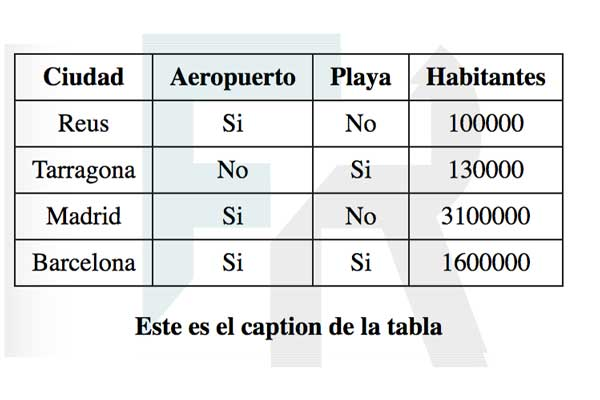

# Tablas

En HTML cada tabla está asociado a un elemento table, dentro de este elemento se indican las filas mediante el elemento tr y dentro de cada fila se indican las celdas mediante elementos td.

En HTML 5 las etiquetas table y tr no tienen atributos, aunque hay atributos, como por ejemplo el atributo border, que reconocen los navegadores por estar presentes en versiones anteriores de HTML. Es, como siempre, el lenguaje CSS el que determina la apariencia y formato de la tabla.

Ejemplo:

```html
<!DOCTYPE html>
<html lang="es" dir="ltr">
  <head>
    <meta charset="utf-8">
    <title>Imágenes</title>
  </head>
  <body>
    <table>
        <tr>
            <td></td>
            <td>Lunes</td>
            <td>Martes</td>
            <td>Miércoles</td>
            <td>Jueves</td>
            <td>Viernes</td>
        </tr>
        <tr>
            <td>10:30</td>
            <td>Matemáticas</td>
            <td>Geografía</td>
            <td>Física</td>
            <td>Dibujo</td>
            <td>Matemáticas</td>
        </tr>

        <tr>
            <td>11:30</td>
            <td>Inglés</td>
            <td>Lenguaje</td>
            <td>Geografía</td>
            <td>Química</td>
            <td>Física</td>
        </tr>
    </table>
  </body>
</html>
```

Y quedaría:


## Etiquetas semánticas de tablas

Para que los motores de búsqueda entiendan mejor el contenido dentro de una tabla disponemos de las etiquetas

* `<thead>`: Sirve para indicar las filas que forman la cabecera de la tabla
* `<tbody>`: Indica el cuerpo de la tabla
* `<tfooter>`: Indica el pie de la tabla
* `<caption>`: Indica el título de la tabla
* `<th>`: Sirve para indicar la celda que tiene información de la cabecera

## Ejercicio 1

Dado el siguiente documento html se desea conseguir el resultado de la imagen adjunta.

```html
<!DOCTYPE html>
<html>
<head>
	<title>Ejercicio tablas html</title>
	<meta charset="utf-8"/>
	<meta name="author" content="francesc ricart"/>
	<style>
		table{
			border-collapse:collapse;
			caption-side: bottom;
		}
		caption{
			font-weight:bold;
			margin-top:16px;
		}
		th,td{padding:5px 10px;}
		td,th{border:1px solid #1c1c1c;text-align:center;}

	</style>
</head>
<body>

<!-- puedes copiar y pegar todo el código en sublime o brackets para resolver el ejercicio -->

</body>
</html>
```



Fijaros que el enunciado adjunto un poco de código css para que el resultado sea el de la imagen.

[Compruebe la solución](doc/solucion7.txt)


