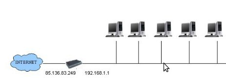

## Repaso TCP/IP

1. Teniendo en cuenta el siguiente esquema de red:

	

	* Configura la interfaz de red de un cliente para tener acceso a internet, utiliza direccionamiento estático. ¿Qué diferencia hay entre dirección estática y dinámica? ¿Qué dirección del router es la pública? ¿Cuál es la privada? Define cada uno de los parámetros que has configurado: puerta de enlace, mascara de red,...

2. Cambia el direccionamiento de red de nuestra internet con la red 172.22.0.0/16 ¿Cuantos equipos podemos tener en esta red?
3. Nuestro clientes pueden acceder a internet porque el router hace Source NAT ¿Explica en que consiste? Si tenemos un servidor linux haciendo de router, ¿cómo se configura para hacer SNAT?. Del mismo modo si tenemos un servidor Windows, ¿cómo se se configura?
4. ¿Qué puerto se utiliza por defecto para conectarse a un servidor web?¿Y para el servidor DNS? ¿Para qué se usa el puerto 22?
5. Imagina que en nuestra intranet instalamos un servidor web. ¿Qué configuración hay que hacer en el router para poder acceder desde internet al servidor? ¿Cómo se llama esta técnica?
6. Si nombramos las máquinas de nuestra intranet, y tenemos un sistema linux, ¿en qué fichero se configura el nombre?
7. ¿Qué es la resolución estática de nombres? ¿En qué fichero se configura en Windows?¿Y en linux?
8. Si nuestro cliente tiene un sistema linux, ¿en qué fichero hemos configurado la red?¿y los servidores DNS?
9. Muestra la configuración de red de tu ordenador de clase. ¿Qué servidor DNS se está utilizando.

## Repaso DNS

10. ¿Qué herramientas se usa en linux para realizar una consulta DNS?¿Y en Windows? Pregunta en varios sistemas cuál es la dirección IP de www.marca.com. Realiza una consulta para saber los servidores DNS que conocen el dominio gonzalonazareno.org.
11. ¿Qué ocurre si hacemos una consulta para averiguar la ip de dit.gonzalonazareno.org desde el ordenador del aula y desde el ordenador de tu casa? Razona la respuesta.
12. A qué servidor DNS le estás consultando desde clase. Realiza una consulta a www.google.es consultando a nuestro DNS. Vuelve a hacer la consulta usando el servidor público que ofrece google.
13. ¿Qué información puedo guardar en una zona DNS? ¿Qué registros puedo guardar? ¿Cuantos tipos de zonas existen?
14. Si desde clase, consulto la dirección IP de www.josedomingo.org? ¿Cuál es el proceso de consultas que se realiza? ¿A que servidores se va preguntando?
15. ¿Qué son los root server? ¿Cuántos hay?
16. Haz una consulta a www.nyu.edu ¿Cuánto ha tardado la consulta?. Vuelve a hacerla, ¿Ha durado menos? ¿por qué?
17. ¿Por qué desde clase la consulta a la dirección IP dit.gonzalonazareno.org es distinta que si la hacemos desde casa?
18. ¿Qué dirección IP tiene babuino.gonzalonazareno.org y dit.gonzalonazareno.org desde clase?¿Qué relación existe ambos nombres?
19. ¿A que servidor mandamos el correo cuya dirección de destino es correo@josedomingo.org? ¿Y si lo mandamos a usuario@amazon.es?
20. Desde clase, ¿cómo se llama el ordenador que tiene la dirección IP 192.168.103.2?
21. ¿Por qué hay varios servidores con autoridad sobre la zona josedomingo.org?
22. Una vez que sepas la dirección del servidor con autoridad sobre la zona josedomingo.org, realiza una consulta a ese servidor preguntando por www.josedomingo.org. ¿qué proceso de consultas se sigue?
