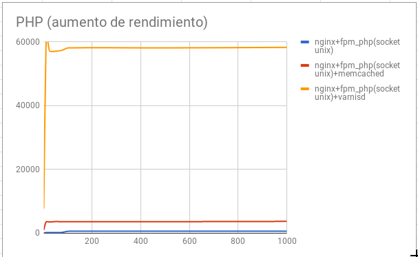

(4 tareas - 15 puntos)
{: .notice--warning}
    
## Ejecución de scripts PHP

Vamos a comparar el rendimiento de distintas configuraciones de servidores web sirviendo páginas dinámicas programadas con PHP, en concreto vamos a servir un CMS Wordpress.

Las configuraciones que vamos a realizar son las siguientes:
	
* Módulo php5-apache2
* PHP-FPM (socket unix) + apache2
* PHP-FPM (socket TCP) + apache2
* PHP-FPM (socket unix) + nginx 
* PHP-FPM (socket TCP) + nginx 



* **Tarea 1 (5 puntos)**: Realiza las configuraciones indicadas anteriormente y muestra una comprobación (con `phpinfo()`) donde se vea la configuración actual.

* Explica brevemente la modificación en los ficheros de configuración para cada una de las opciones.
* En cada una de las configuraciones debe funcionar el CMS WordPress.
* Cuando accedes a la biblioteca de medios de WordPress para subir una imagen, vemos que el tamaño máximo es 512Mb:

    

    Modifica ela configuración de PHP en cada caso para aumentar el tamaño de los ficheros que podemos subir.

* Realiza varias pruebas (al menos 5) de rendimiento sobre cada configuración y quedáte con una media de las peticiones respondidas por segundo. ¿Qué configuración responde más peticiones por segundo?. Vamos a realizar pruebas con 200 peticiones concurrentes:

        ab -t 10 -c 200 -k http://172.22.x.x/index.php
    
    Nota: Recuerda reinciar el servidor web entre prueba y prueba.


{{ notice-text | markdownify }}

### Rendimiento

Después de hacer varias pruebas de rendimiento con un número variable de peticiones concurrentes (1, 10, 25, 50, 75, 100, 250, 500, 1000). Los resultados obtenidos son los siguientes:

Podemos determinar que la opción que nos ofrece más rendimiento es nginx + fpm_php (socket unix).

A partir de esa configuración vamos a intentar aumentar el rendimiento de nuestro servidor.

## Aumento de rendimiento en la ejecución de scripts PHP



* **Tarea 2 (2 puntos)**: Añade a la configuración **ganadora del punto anterior** memcached. Documenta la instalación y configuración memcached. Recuerda que para que Wordpress utilice memcached le tenemos que instalar un plugin. Muestra las estadísticas de memcached después de acceder varias veces a wordpress para comprobar que esa funcionando. Realiza varias pruebas de rendimiento y comprueba si hemos aumentado el rendimiento.
* **Tarea 3 (3 puntos)**: Configura un proxy inverso - caché Varnish escuchando en el puerto 80 y que se comunica con el servidor web por el puerto 8080. Entrega y muestra una comprobación de que varnish está funcionando con la nueva configuración. Realiza pruebas de rendimiento y comprueba si hemos aumentado el rendimiento. Si hacemos varias periciones a la misma URL, ¿cuantas peticiones llegan al servidor web? (comprueba el fichero `access.log` para averiguarlo.)

{{ notice-text | markdownify }}

### Rendimiento

Veamos las tres opciones que hemos configurado y veamos los resultados después del estudio de rendimiento:

Podemos observar como el uso de varnishd aumenta muy significativamente el rendimiento de nuestro servidor.

## Ejecución de scripts Python

Vamos a comparar el rendimiento de distintas configuraciones de servidores web sirviendo páginas dinámicas programadas con Python, en concreto vamos a servir un CMS Mezzanine (Instala algunas páginas de demostración durante la instalación: `Would you like to install some initial demo pages?`).

Las configuraciones que vamos a realizar son las siguientes:
	
* apache2 + Módulo wsgi
* apache2 + gunicorn
* apache2 + uwsgi
* nginx + gunicorn
* nginx + uwsgi



* **Tarea 4 (5 puntos)**: Documenta la instalación y configuración para cada una de las configuraciones propuestas en el ejercicio. En cada una de las configuraciones debe ejecutarse un CMS python, por ejemplo, Mezzanine. Realiza varias pruebas (al menos 5) de rendimiento sobre cada configuración y quedáte con una media de las peticiones respondidas por segundo. ¿Qué configuración responde más peticiones por segundo?.

{{ notice-text | markdownify }}

## Rendimiento

Podemos observar que la opción que más rendimiento ofrece es nginx + uwsgi.