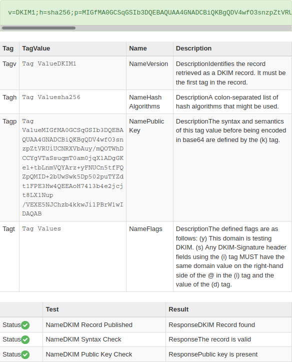

## IPs estáticas y limpias

La técnica más importante para asegurar el envío de nuestro correo y luchar contra el spam son las listas negras. Podemos configurar nuestro servidor de correo para que consulte en las distintas listas que existen la dirección de ip de origen [How To Block Spam Before It Enters The Server (Postfix)](https://www.howtoforge.com/block_spam_at_mta_level_postfix). Tenemos muchos sitios para ver si nuestra ip está en una lista negra:

* [dnsbl.info](https://www.dnsbl.info/dnsbl-database-check.php)
* [mxtoolbox ](http://mxtoolbox.com/blacklists.aspx)
* [Spamhaus Block List ](http://www.spamhaus.org/sbl/index.lasso)
* [Cisco IronPort SenderBase Security Network ](http://www.senderbase.org/)

## SPF

En principio cualquier máquina puede enviar mensajes de correo a cualquier destino utilizando cualquier remitente, esto es así en principio para permitir que podamos enviar mensajes con diferentes remitentes usando un mismo servidor de correos, pero esta característica del correo ha sido masivamente usada para inundar de mensajes no deseados los servidores de correo y para hacer suplantación del remitente (email spoofing), por lo que se ha generalizado la implementación de medidas complementarias para reducir al máximo este problema y hoy en día la mayoría de servidores de correo o rechazan o mandan a la bandeja de spam los mensajes que lleguen desde servidores que no implementen algún mecanismo adicional de autenticación.

**Sender Policy Framework (SPF)** es un mecanismo de autenticación que mediante un registro DNS de tipo TXT describe las direcciones IPs y nombres DNS autorizados a enviar correo @DOMINIO. Actualmente muchos servidores de correo exigen como mínimo tener un registro SPF para tu correo o en caso contrario los mensajes provenientes de tu servidor se clasifican como spam o se descartan directamente.

Se pueden especificar diversos campos en el registro, pero en este caso, que tenemos un solo equipo con una dirección IPv4, una dirección IPv6 y el nombre de dominio asociado a la IP, podemos poner como registro SPF el siguiente:

    DOMINIO.    600 IN  TXT "v=spf1 a mx ip4:IPv4/32 ip6:IPv6/128 a:DOMINIO. -all"

Es importante comentar el signo que aparece antes de `all`, ya que podemos indicarle a los otros servidores lo que deben hacer si reciben correo desde otra dirección o máquina diferente a las que aparecen en el registro anterior:

* `-`: Descartar el mensaje
* `~`: Clasificarlo como spam
* `?`: Aceptar el mensaje (sería como no usar SPF)

De esta forma el correo que enviemos desde nuestra máquina, pasará los filtros SPF en destino y la mayoría de nuestros correos llegarán a destino con poca probabilidad de que se clasifiquen como spam. 

Para más información puedes leer el documento: [Sender Policy Framework (SPF)](https://github.com/josedom24/serviciosgs_doc/raw/master/correo/doc/SPF.pdf)

## DKIM

**DomainKeys Identified Mail o DKIM** es un método de autenticación pensado principalmente para reducir la suplantación de remitente. DKIM consiste en que se publica a través de DNS la clave pública del servidor de correos y se firman con la correspondiente clave privada todos los mensajes emitidos, así el receptor puede verificar cada correo emitido utilizando la clave pública.

Para configurar DKIM en nuestro servidor instalaremos `opendkim` y `opendkim-tools` y realizaremos la siguiente configuración:

    grep -v '^$\|^#' /etc/opendkim.conf

    Syslog          yes
    UMask           002
    Canonicalization        relaxed/simple
    ExternalIgnoreList      refile:/etc/opendkim/TrustedHosts
    InternalHosts           refile:/etc/opendkim/TrustedHosts
    KeyTable                refile:/etc/opendkim/KeyTable
    SigningTable            refile:/etc/opendkim/SigningTable
    Mode            sv
    Socket          local:/var/spool/postfix/opendkim/opendkim.sock
    PidFile         /var/run/opendkim/opendkim.pid
    OversignHeaders     From
    TrustAnchorFile     /usr/share/dns/root.key
    UserID          opendkim

Donde hemos modificado el servicio para que se ejecute en un socket dentro del directorio postfix, porque a continuación vamos a conectar ambos servicios. Editamos el fichero `/etc/opendkim/TrustedHosts` e incluimos una lista de todos los nombres e IPs en los que se confía directamente (todos los posibles nombres de la propia máquina de momento):

    127.0.0.1
    ::1
    localhost
    HOSTNAME
    *.DOMINIO

Creamos el directorio `/etc/opendkim/keys/DOMINIO/` y lo protegemos adecuadamente, ya que vamos a ubicar dentro la clave privada de DKIM:

    mkdir  /etc/opendkim/keys/DOMINIO/
    chown opendkim. /etc/opendkim/keys/DOMINIO/
    chmod 0710 /etc/opendkim/keys/DOMINIO/

Usamos la aplicación `opendkin-genkey` para generar la clave privada y el registro para el DNS:

    opendkim opendkim-genkey -D /etc/dkimkeys/keys/DOMINIO -d DOMINIO -s mail

Esto genera los ficheros `mail.private` y `mail.txt`, el primero con la clave privada y el segundo con el registro TXT que debemos agregar a nuestro DNS:

    mail._domainkey IN  TXT ( "v=DKIM1; h=sha256; k=rsa; "
                                  "p=MIIBIjANBgkqhkiG9w...Klw"
                                   "va0hJE12...AQAB" )  ;

Modificamos los siguientes ficheros:

* `/etc/opendkim/SigningTable`
	
        *@DOMINIO mail._domainkey.DOMINIO

* `/etc/opendkim/KeyTable`

	    mail._domainkey.DOMINIO DOMINIO:mail:/etc/opendkim/keys/DOMINIO/mail.private

Verificamos que la configuración del registro de DKIM es correcta utilizando alguna [herramienta externa](https://mxtoolbox.com/dkim.aspx), que da los resultados de forma fácilmente interpretable:

Ahora queda configurar postfix para que firme los correos que envía, para lo que editamos el fichero /`etc/postfix/main.cf` y añadimos:

    milter_default_action = accept
    milter_protocol = 6
    smtpd_milters = local:/opendkim/opendkim.sock
    non_smtpd_milters = $smtpd_milters

## DMARC

**DMARC** es el último mecanismo de autenticación que vamos a configurar, realmente lo hace DMARC es ampliar el funcionamiento de SPF y DKIM, mediante la publicación en DNS de la política del sitio, en el que decimos si usamos, SPF, DKIM o ambos, entre otras cosas.

La configuración de DMARC para el correo saliente es sencilla, consiste en un registro DNS TXT en el que se especifica si se está usando SPF y/o DKIM y qué hacer con el correo que no cumpla con los mecanismos de autenticación que estén habilitados, como en este caso están ambos, creamos un registro como el siguiente:

    _dmarc.DOMINIO. 3600    IN  TXT "v=DMARC1; p=quarantine;adkim=r;aspf=r; rua=mailto:postmaster@DOMINIO"

Se pueden ver los detalles del formato en [What is a DMARC DNS Record?](https://mxtoolbox.com/dmarc/details/what-is-a-dmarc-record).

