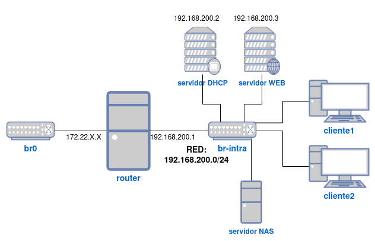

## Creación del escenario

Todas las operaciones las tiene que hacer desde la línea de comandos:

1. Crea una **red muy aislada**, que se llame **red_intra** que creará el puente `br-intra`. Esta red se tiene que iniciar cada vez que encendemos el host.
2. Crea con `virt-install` la máquina **router** con Debian 12: 
	* Está conectada a la red pública (al bridge `br0`) y la **red_intra**.
	* Esta máquina utiliza un disco en formato **raw** de 10 Gb.
	* El hostname de esta máquina debe ser `router-tunombre`.
	* Se debe poder acceder a ella por ssh con el usuario root sin que te pida contraseña (configura tu clave pública y la mia).
	* Debes configurar la segunda interfaz de red con direccionamiento estático para que tenga la dirección `192.168.200.1`.
	* Está máquina se debe iniciar cada vez que arrancamos el host.
3. Crea con `virt-install` la máquina **servidorNAS** con Alpine Linux 3.20.
    * Está conectada a la red **red_intra**, su dirección IP debe ser la `192.168.200.2`.
    * La máquina tendrá un disco qcow2 de 15Gb.
    * El hostname de esta máquina debe ser `nas-tunombre`.
	* Se debe poder acceder a ella por ssh con el usuario root sin que te pida contraseña (configura tu clave pública y la mia).
    * Está máquina se debe iniciar cada vez que arrancamos el host.
4. Crea dos contenedores LXC conectados a la red **red_intra**. 
	* **servidorDHCP**: Es un contador creado a partir de la plantilla **Debian Bookworm**. Configura su red de forma estática. Su dirección IP debe ser la `192.168.200.3`.
	* **servidorWeb**: Es un contador creado a partir de la plantilla **Ubuntu 22.04 Jammy**. Configura su red de forma estática. Su dirección IP debe ser la `192.168.200.4`.
	* Los contenedores se deben iniciar de forma automática y se les debe limitar la memoria a 512Mb.
5. Configura la máquina **router** para que haga SNAT y permita que los contenedores tengan acceso al exterior (**La configuración debe ser persistente.**). Instala en los contenedores el servidor ssh y configúralo para que podamos entrar con clave privada (configura tu clave pública y la mia) por ssh con el usuario `root`.


## Entrega

1. Fichero xml con la definición de la red **red_intra**, la instrucción de creación y la que permite el inicio automático.
2. Comprobación que el volumen de la máquina **router** tiene el formato raw.
3. El comando `virsh` que muestra información de las máquinas **router** y **servidorNAS** para comprobar que se inicia de forma automática.
4. Salida del comando `ip a` en **router**.
5. Acceso por ssh sin que te pida la contraseña al **router**.
6. Acceso por ssh sin que te pida la contraseña al **servidorNAS**.
7. Lista los contenedores creados para que se visualice su dirección IP y se vea que se inician de forma automática.
8. Prueba de funcionamiento de que se ha limitado la memoria de los contenedores de forma adecuada.
9. Salida de la instrucción `iptables` que muestra la regla de SNAT que has configurado.
10. Comprobación que los contenedores tienen acceso al exterior.
11. Desde el host, utiliza `ssh -A`, para acceder al **router** y posteriormente a los contenedores y a la máquina **servidorNAS**.
12. Busca información sobre la configuración de ssh para definir distintos accesos. Configura el fichero `~/.ssh/config` en tu equipo para que puedas acceder desde el host directamente a los contenedores  y a la máquina **servidorNAS**..

{{ notice-text | markdownify }}
