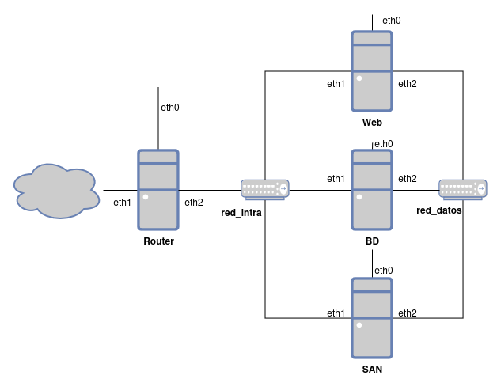

## Vagrant

Queremos automatizar la creación de un servidor LAMP usando Vagrant, el esquema que queremos desarrollar, que vemos en la imagen, tiene las siguientes características:

Es escenario tiene cuatro máquinas:

* `router`: que está conectada a una red pública (**br0**) y a una red privada (muy aislada) **red_intra**. La máquina `router` debe salir por la red pública. **Esta máquina no va a utilizar eth0 para acceder al exterior**.
* `web`: En este servidor se instalará un servidor web. Esta máquina está conectada al **router** por la **red_intra**. Y esta conectada por otra red muy aislada **red_datos** a las otras máquinas del escenario.
* `bd`: En este servidor se instalará un gestor de bases de datos. Esta máquina está conectada al **router** por la **red_intra**. Y esta conectada por otra red muy aislada **red_datos** a las otras máquinas del escenario.
* `san`: Este el el servidor de almacenamiento. Posee almacenamiento configurado en RAID5 y nos permite compartir dispositivos de bloque por medio de iSCSI. 
    * Esta máquina está conectada al **router** por la **red_intra**. Y esta conectada por otra red muy aislada **red_datos** a las otras máquinas del escenario.
    * Está máquina tiene configurado 3 discos de 2G.


## Entrega

1. Entrega el fichero `Vagrantfile` que has usado para construir el escenario..
2. Entrega una captura de pantalla accediendo por ssh a alguna de las máquinas internas:
    * No uses `vagrant ssh`, es decir sin hacer conexiones a `eth0`.
    * Usa la opción `-A`  de ssh para acceder a algunas de las máquinas internas.
    * Desde esa máquina accede a otra usando el direccionamiento de **red_intra**.
3. Comprobación que el servidor `san` tiene los discos que hemos configurado.

{{ notice-text | markdownify }}

