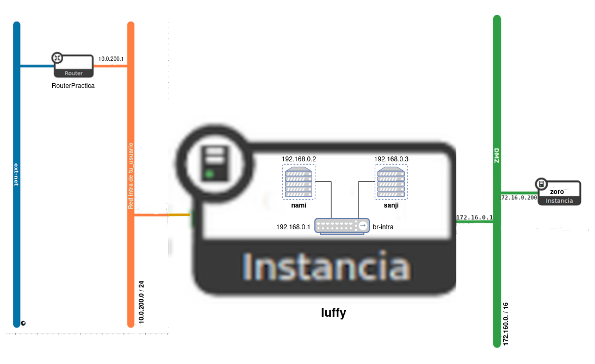

En esta tarea se va a crear el escenario de trabajo que se va a usar durante todo el curso, que va a constar inicialmente de 4 máquinas: 2 instancias en OpenStack y dos contenedores LXC que se ejecutarán en una de las instancias.

Para nombrar las máquinas se van a utilizar los siguientes nombres: **luffy, zoro, nami, sanji**. Estos nombres pertenecen la serie manga **One Piece**.

Además el dominio será un subdominio de la forma `tunombre.gonzalonazareno.org`. De esta forma tendremos:

* Máquina 1: Instancia en OpenStack con **Debian 12 Bookworm** que se llama `luffy.tunombre.gonzalonazareno.org`.
* Máquina 2: Instancia en OpenStack con **Rocky Linux 9** que se llama `zoro.tunombre.gonzalonazareno.org`.
* Máquina 3: Contenedor LXC con **Ubuntu 22.04** que se llama `nami.tunombre.gonzalonazareno.org`.
* Máquina 4: Contenedor LXC con **Ubuntu 22.04** que se llama `sanji.tunombre.gonzalonazareno.org`.

Todas las operaciones que realices sobre recursos de OpenStack lo tienes que hacer usando OSC.

## Escenario

## Creación de la infraestructura de red

* Crea un nuevo router llamado **RouterPractica** conectado a la red externa.
* Crea una red interna que se llame **Red Intra de tu_usuario**, con las siguientes características:
	* Está conectada al router que has creado en el punto anterior.
	* Direccionamiento: `10.0.200.0/24`
	* Con DHCP y DNS (`172.22.0.1`).
	* La puerta de enlace de los dispositivos conectados a esta red será el `10.0.200.1`.
* Crea una red interna que se llame **Red DMZ de tu_usuario**, con las siguientes características:
	* Direccionamiento: `172.16.0.0/16`
	* **Sin DHCP**.
	* **Deshabilitamos la puerta de enlace.** Esto es para que *cloud-init* no configure la puerta de enlace en las instancias conectada a esta red.
	* La puerta de enlace de los dispositivos conectados a esta red será el `172.16.0.1`.


## Entrega

1. Las instrucciones para crear el router y las redes.
2. Una captura de pantalla donde se vea la Topología de Red en Horizon que has creado.


{{ notice-text | markdownify }}

## Instalación de las instancias de OpenStack

### Configuración de las instancias

Las dos instancias que vamos a crear se van a configurar con `cloud-init` de la siguiente manera:

* Deben actualizar los paquetes de la distribución de la instancia.
* El dominio utilizado será del tipo `tunombre.gonzalonazareno.org`. Por lo tanto en la configuración con `cloud-init` habrá que indicar el hostname y el FQDN.
* Se crearán dos usuarios: 
	* Un usuario sin privilegios. Se puede llamar como quieras (pero el nombre será el mismo en todas las máquinas) y accederás a las máquinas usando tu clave ssh privada.
	* Un usuario `profesor`, que puede utilizar `sudo` sin contraseña. Copia de las claves públicas de todos los profesores en las instancias para que puedan acceder con el usuario `profesor`.
* Cambia la contraseña al usuario `root`.

### Creación de las instancias

#### máquina1 (luffy)

* Crea una instancia sobre un volumen de 15Gb (el volumen se crea durante la creación de la instancia), usando una imagen de **Debian 12 Bookworm**. Elige el sabor `vol.medium`. Y configuralá con `cloud-init` como se ha indicado anteriormente.
* Está instancia estará conectada a las dos redes. Recuerda que en la red **Red DMZ** debe tomar la dirección `172.16.0.1` (puerta de enlace las máquinas conectadas a esta red). Asigna a la instancia una IP flotante.
* Deshabilita la seguridad de los puertos en las dos interfaces de red para que funcione de manera adecuada el NAT.
* Configura de forma permanente la regla SNAT para que las máquinas de la **Red DMZ** tengan acceso a internet.

#### maquina2 (zoro)

* Crea un volumen de 15Gb con la imagen **Rocky Linux 9**.
* Crea la instancia a partir de este volumen. Elige el sabor `vol.medium`. Y configúrala con `cloud-init` como se ha indicado anteriormente.
* En un primer momento, para que la instancia se configure mediante *cloud-init* conecta esta instancia a un red con DHCP.
* Posteriormente, desconecta la interfaz de red de esa red y conéctala a la red **Red DMZ** a la dirección `172.16.0.200`.
* Recuerda, que esa configuración no se hará de forma automática por lo que deberas, de forma manual, configurar la red en esta máquina. recuerda que Rocky Linux tiene instalado por defecto NetwokManager.
* Deshabilita la seguridad de los puertos en la interfaz de red para que funcione de manera adecuada el NAT.
* Comprueba que tiene acceso a internet.


## Entrega

1. Las instrucciones para crear y configurar las máquinas.
2. Los ficheros `cloud-config.yaml` que has usado para crear las instancias.
3. La IP flotante de la **máquina1 (luffy)**.
4. Una captura de pantalla donde se vea la Topología de Red en Horizon que has creado.
5. Prueba de funcionamiento de qué los FQDN están bien configurados en las dos máquinas.
6. Prueba de funcionamiento de que se pueden acceder a todas las máquinas por ssh.
7. Prueba de funcionamiento de que las máquinas tienen acceso a internet accediendo a un nombre de dominio, para comprobar que funciona el DNS.


{{ notice-text | markdownify }}

