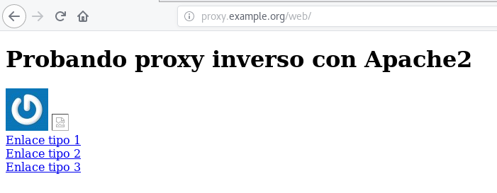
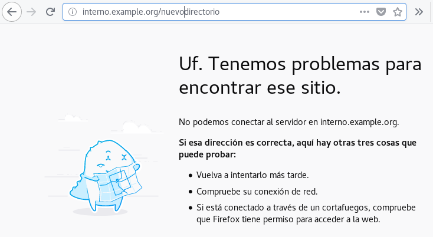
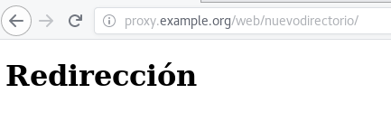

Un proxy inverso es un tipo de servidor proxy que recupera recursos en nombre de un cliente desde uno o más servidores. Por lo tanto el cliente hace la petición al puerto 80 del proxy, y éste es el que hace la petición al servidor web que normalmente está en una red interna no accesible desde el cliente.

## Apache como proxy inverso

Apache2.4 puede funcionar como proxy inverso usando el módulo `proxy` junto a otros módulos, por ejemplo:

  * proxy_http: Para trabajar con el protocolo HTTP.
  * proxy_ftp: Para trabajar con el protocolo FTP.
  * proxy_html: Permite reescribir los enlaces HTML en el espacio de direcciones de un proxy.
  * proxy_ajp: Para trabajar con el protocolo AJP para Tomcat.
  * &#8230;

Por lo tanto, para empezar, vamos activar los módulos que necesitamos:

    # a2enmod proxy proxy_http

## Ejemplo de utilización de proxy inverso

Tenemos a nuestra disposición un servidor interno (no accesible desde el cliente) en la dirección privada, con el nombre de `interno.example.org`. Tenemos un servidor que va a funcionar de proxy, llamado `proxy.example.org` con dos interfaces de red: una pública conectada a la red donde se encuentra el cliente, y otra interna conectada a la red donde se encuentra el servidor interno.

Puedes bajar este [fichero](doc/apacheproxy/vagrant.zip) para crear la infraestructura con vagrant.

### Sirviendo una página estática

En nuestro servidor interno hemos creado un virtual host para servir una página estática, `index.html`, con este contenido:

    <!DOCTYPE html>
    <html lang="es">
    <head>
        <meta charset="UTF-8">
        <title>Probando proxy inverso con Apache2</title>
    </head>
    <body>
            <h1>Probando proxy inverso con Apache2</h1>
            
            
             
             
            <a href="directorio">Redirección</a>
              
            <a href="http://10.0.0.6/carpeta/index.html">Enlace tipo 1</a> 
            <a href="/carpeta/index.html">Enlace tipo 2</a> 
            <a href="carpeta/index.html">Enlace tipo 3</a>
    </body>
    

Vamos a utilizar la directiva [`ProxyPass`](https://httpd.apache.org/docs/2.4/mod/mod_proxy.html#proxypass) en el fichero de configuración del virtual host, de la siguiente forma:

    ProxyPass "/web/" "http://interno.example.org/"
    

También lo podemos configurar de forma similar con:

    <Location "/web/">
        ProxyPass "http://interno.example.org/"
    </Location>
    

Evidentemente debe funcionar la resolución de nombre para que el proxy pueda acceder al servidor interno.

De esta manera al acceder desde el cliente la URL `http://proxy.example.org/web/` se mostraría la página que se encuentra en el servidor interno.

Como vemos una imagen no se ha cargado, además no todos los enlaces funcionan, pero antés vamos a solucionar el problema de las redirecciones.

### El problema de las redirecciones

Cuando creamos una redirección en un servidor web y el cliente intenta acceder al recurso, el servidor manda una respuesta con código de estado `301` o `302`, e indica la URL de la nueva ubicación del recurso en una cabecera HTTP llamada `Location`.

Si hemos configurado una redirección en el servidor interno, cuando se accede al recurso a través del proxy, la redirección se realiza pero la cabecera `Location` viene referencia la dirección del servidor interno, por lo que el cliente es incapaz de acceder a la nueva ubicación. Al acceder a ´http://proxy.example.org/web/directorio´ se produce una redirección pero como vemos la nueva url hace referencia al servidor interno por lo que no funciona:

Para solucionarlo utilizamos la directiva [`ProxyPassReverse`](https://httpd.apache.org/docs/2.4/mod/mod_proxy.html#proxypassreverse) que se encarga de reescribir la URL de la cabecera `Location`.

La configuración quedaría:

    ProxyPass "/web/" "http://interno.example.org/"
    ProxyPassReverse "/web/" "http://interno.example.org/"
    

O de esta otra forma:

    <Location "/web/">
        ProxyPass "http://interno.example.org/"
        ProxyPassReverse "http://interno.example.org/"
    </Location>
    

Por lo que ya podemos hacer la redirección de forma correcta:

