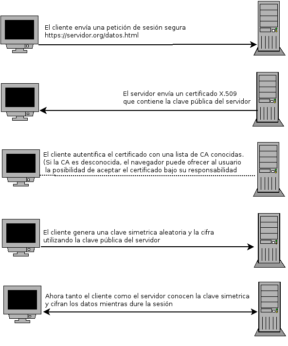

Cada vez es más necesario cifrar el contenido que se trasmite entre el cliente y el servidor, este proceso nos permite asegurar por ejemplo el proceso de autenticación de usuarios para evitar que alguien capture una contraseña de usuario y acceda de forma fraudulenta.

El cifrado de la comunicación entre el navegador y el servidor web se hace mediante el protocolo HTTPS, que tiene las siguientes características principales:

* Utiliza el protocolo SSL (actualmente TLS) para el cifrado de datos.
* El servidor utiliza por defecto el puerto 443/tcp.
* Utiliza mecanismos de cifrado de clave pública y las claves públicas se denominan certificados.
* El formato de los certificados está especificado por el estándar X.509 y normalmente son emitidos por una entidad denominada Autoridad Certificadora (CA por sus siglas en inglés).
* En el caso de HTTPS, la función principal de la CA es demostrar la autenticidad del servidor y que pertenece legítimamente a la persona u organización que lo utiliza. Dependiendo de los criterios utilizados para comprobar la autenticidad del servidor se emiten diferentes tipos de certificados X.509 (actualmente se usa el llamado Extended Validation Certificate).
* El navegador contiene una lista de certificados de CA en las que confía y acepta inicialmente sólo los certificados de los servidores emitidos por alguna de estas CA.
* Una vez aceptado el certificado de un servidor web, el navegador utiliza éste para cifrar los datos que quiere enviar al servidor mediante el protocolo HTTPS y cuando llegan al servidor sólo éste podrá descifrarlos ya que es el único que posee la clave privada que los descifra.

El funcionamiento de forma esquemática de HTTPS la podríamos resumir en el siguiente gráfico:

