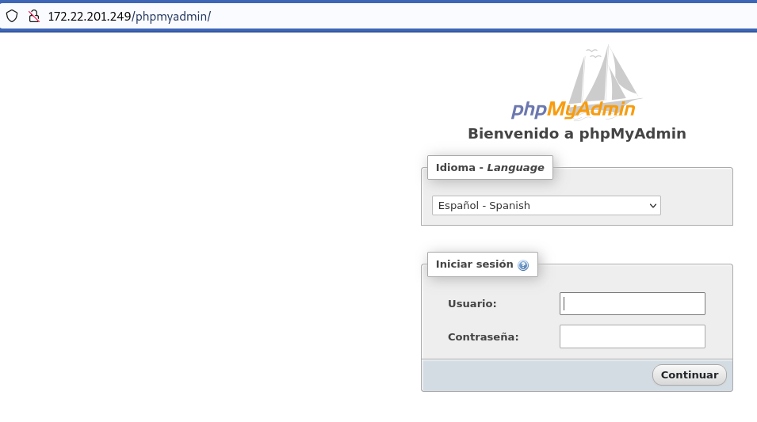

## ¿Qué vas a aprender en este taller?

* Vamos a instalar una aplicación PHP en el servidor web apache2.
* Lo más importante es que vamos a trabajar con virtualhost, alias, módulos y configuraciones adicionales.

## ¿Qué tienes que hacer?

En primer lugar, configura en tu servidor web un servicio LAMP para instalar una aplicación PHP y tener disponible un gestor de base de datos (**Puedes usar cualquier máquina donde tengas ya instalado el servidor LAMP**).
[phpmyadmin](https://www.phpmyadmin.net/) es una aplicación web escrita en PHP que nos posibilita la gestión de una base de datos mysql/mariadb. Normalmente vamos a instalar las aplicaciones web descargando directamente el código de la aplicación al servidor, pero en este ejercicio vamos a instalar la aplicación desde los repositorios de Debian.

Realiza los siguientes pasos:

1. Accede desde el terminal a la base de datos con el `root` (con contraseña) y crea una base de datos y un usuario que tenga permiso sobre ella.
2. Instala desde los repositorios la aplicación `phpmyadmin`. En la instalación nos pregunta que servidor estamos usando, en nuestro caso elegimos **apache2**. Además elegimos que **No** se configure la base de datos en el proceso de instalación-. Accede con un navegador a la URL `http://ip_servidor/phpmyadmin` (usa el nombre de usuario creado en el punto anterior).

	

3. ¿Se ha creado en el DocumentRoot (`/var/www/html`) un directorio que se llama `phpmyadmin`? Entonces, ¿cómo podemos acceder?
4. La instalación de `phpmyadmin` ha creado un fichero de configuración en apache2: `/etc/apache2/conf-available/phpmyadmin.conf` (que es un enlace simbólico a `/etc/phpmyadmin/apache.conf`). La primera línea del fichero es:

        Alias /phpmyadmin /usr/share/phpmyadmin

    La directiva [Alias](http://httpd.apache.org/docs/trunk/es/mod/mod_alias.html) nos permite crear una ruta `phpmyadmin` que nos muestra los ficheros que hay en un directorio que está fuera del DocumentRoot, en este caso `/usr/share/phpmyadmin`, es decir, la aplicación está realmente en ese directorio.
5. Quita la configuración de acceso a `phpmyadmin` con el comando `a2disconf` y comprueba que ya no puedes acceder. A continuación crea un virtualhost, al que hay que acceder con el nombre *basededatos.tunombre.org*, y que nos muestre la aplicación. **Nota: En la configuración del virtualhost copia las 3 directivas `directory` que se encuentran en el fichero `/etc/apache2/conf-available/myphpadmin.conf`.**
6. Accede a `phpmyadmin` y comprueba que puedes acceder con el usuario que creaste en el punto 1 y que puede gestionar su base de datos.


## ¿Qué tienes que entregar?

1. Una captura de phpmyadmin donde se vea la base de datos que has creado en el punto 1.
2. ¿Cómo has quitado la configuración de acceso a `phpmyadmin` en el punto 5?
3. Entrega una captura de la configuración del virtualhost.
4. Entrega una captura con el acceso a `phpmyadmin` usando el nombre *basededatos.tunombre.org*, con el usuario que creaste en el punto 1.   

{{ notice-text | markdownify }}

